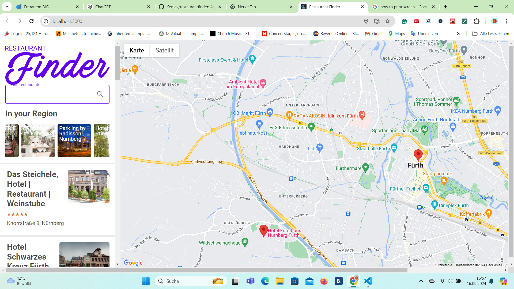
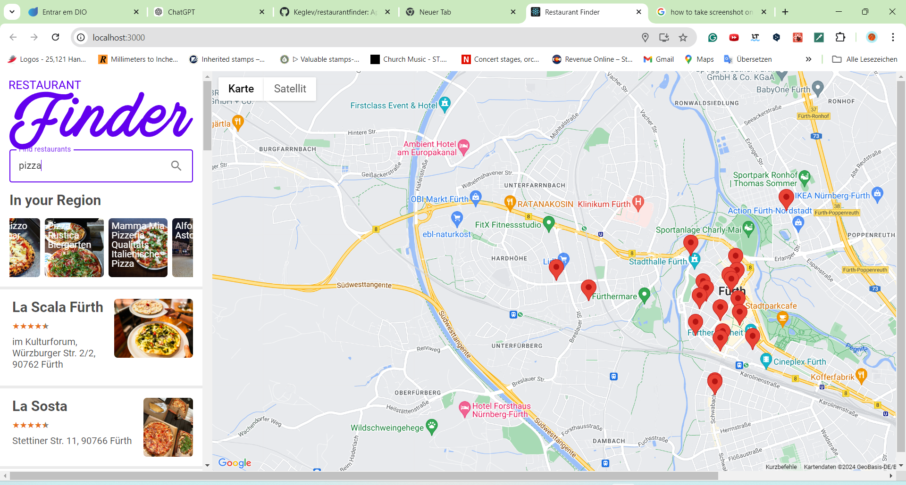

# :plate_with_cutlery: Restaurant Finder App

The Restaurant Finder App helps users discover nearby restaurants based on their location or preferences.
Whether you're looking for a quick bite or a fine dining experience, this app brings you curated results with useful details like ratings, distance, 
and whether they are open or closed based on the user's time.

# Table of Contents

[Features](#Features) 

[Screenshots](#Screenshots)

[Installation](#Instalation)

[Usage](#Usage)

[Available Scripts](#Available-Scripts)

[Technologies](#Technologies)

[API Integration](#API-Integration)

[Contributing](#Contributing)

# Features
📍 Location-based Search: Automatically detects your location and suggests restaurants nearby.

🔍 Custom Search: Search for restaurants by name, cuisine type.

⭐ Ratings: Displays ratings with stars based on Google Reviews

🗺 Interactive Map: View restaurant locations on an interactive map.

📱 Responsive Design: Optimized for both mobile and desktop use.

:alarm_clock: Show if the restaurant is open or closed based on the user system hour.

# Screenshots

# Homepage

Restaurant Search Results

Restaurant Details Page

# Installation
To run this app locally, follow these steps:

1. Clone the repository:

  git clone https://github.com/your-username/restaurant-finder-app.git

2. Navigate to the project directory:
   
  cd restaurant-finder-app

3. Install the dependencies:

   npm install

4. Get API keys from Google Maps API and Yelp Fusion API (or any other restaurant API you're using), and create a .env file in the project root:
   REACT_APP_GOOGLE_MAPS_API_KEY=your-google-maps-api-key
   REACT_APP_YELP_API_KEY=your-yelp-api-key

5. Start the development server:

   npm start

## Usage

Search for Restaurants: After launching the app, the homepage will show restaurants based on your current location. 
You can enter by cuisine type, or any restaurant name if you want. 
View Details: Click on a restaurant to view detailed information including reviews, address, opening hours, and directions.
Map View: Use the interactive map to explore restaurant locations visually.

## Available Scripts

In the project directory, you can run:

### `npm start`

Runs the app in the development mode.\
Open [http://localhost:3000](http://localhost:3000) to view it in your browser.

The page will reload when you make changes.\
You may also see any lint errors in the console.

### `npm test`

Launches the test runner in the interactive watch mode.\
See the section about [running tests](https://facebook.github.io/create-react-app/docs/running-tests) for more information.

### `npm run build`

Builds the app for production to the `build` folder.\
It correctly bundles React in production mode and optimizes the build for the best performance.

The build is minified and the filenames include the hashes.\
Your app is ready to be deployed!

See the section about [deployment](https://facebook.github.io/create-react-app/docs/deployment) for more information.

### `npm run eject`

**Note: this is a one-way operation. Once you `eject`, you can't go back!**

If you aren't satisfied with the build tool and configuration choices, you can `eject` at any time. This command will remove the single build dependency from your project.

Instead, it will copy all the configuration files and the transitive dependencies (webpack, Babel, ESLint, etc) right into your project so you have full control over them. All of the commands except `eject` will still work, but they will point to the copied scripts so you can tweak them. At this point you're on your own.

You don't have to ever use `eject`. The curated feature set is suitable for small and middle deployments, and you shouldn't feel obligated to use this feature. However we understand that this tool wouldn't be useful if you couldn't customize it when you are ready for it.

## Technologies:

Frontend: React, React Router

Backend: Node.js, JavaScript

APIs: Google Maps API

Styling: CSS

Testing: Jest, React Testing Library

Maps: Google Maps API for interactive map views

## API Integration

This app integrates with:

Google Maps API: To display restaurant locations on an interactive map.
For more information, check out the Google Maps API Documentation.

## Contributing

Contributions are welcome! Here's how you can contribute:

1. Fork the repository.
2. Create a new branch (git checkout -b feature/YourFeatureName).
3. Commit your changes (git commit -m 'Add some feature').
4. Commit your changes (git commit -m 'Add some feature').
5. Open a pull request.

## Learn More

You can learn more in the [Create React App documentation](https://facebook.github.io/create-react-app/docs/getting-started).

To learn React, check out the [React documentation](https://reactjs.org/).

### Code Splitting

This section has moved here: [https://facebook.github.io/create-react-app/docs/code-splitting](https://facebook.github.io/create-react-app/docs/code-splitting)

### Analyzing the Bundle Size

This section has moved here: [https://facebook.github.io/create-react-app/docs/analyzing-the-bundle-size](https://facebook.github.io/create-react-app/docs/analyzing-the-bundle-size)

### Making a Progressive Web App

This section has moved here: [https://facebook.github.io/create-react-app/docs/making-a-progressive-web-app](https://facebook.github.io/create-react-app/docs/making-a-progressive-web-app)

### Advanced Configuration

This section has moved here: [https://facebook.github.io/create-react-app/docs/advanced-configuration](https://facebook.github.io/create-react-app/docs/advanced-configuration)

### Deployment

This section has moved here: [https://facebook.github.io/create-react-app/docs/deployment](https://facebook.github.io/create-react-app/docs/deployment)

### `npm run build` fails to minify

This section has moved here: [https://facebook.github.io/create-react-app/docs/troubleshooting#npm-run-build-fails-to-minify](https://facebook.github.io/create-react-app/docs/troubleshooting#npm-run-build-fails-to-minify)
